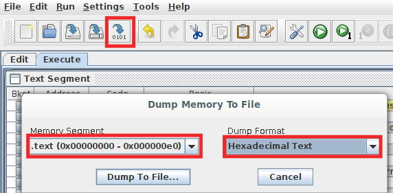

# RISC-V Programming

Use RARS assembler / simulator which can be downloaded [from their GitHub repository](https://github.com/TheThirdOne/rars/releases/tag/continuous). This requires Java to be installed in your system; Java 8 is available [here](https://java.com/en/download/).

The .jar program can be run by double-clicking it. It is portable across operating systems and needs no installation. It is a very simple and easy to use application. Linux users may need to use `java -jar filename.jar` - note the `-jar` option required to run a Java archive. 

You can use [riscv_assembly_sample.asm](https://github.com/NUS-CG3207/lab-skeletons/blob/main/lab1/riscv_assembly_sample.asm) to get started. Download it, and open with RARS - **File** **\>** **Open**. Note : RARS assumes that SP(x2) and GP(x3) are initialized to 0x3ffc and 0x1800 respectively, and other registers are initialized to 0s. In the register file provided in the templates, only register zero (x0) is guaranteed to be 0, and others are uninitialized. You need to write a value to all registers other than x0 before you read them.

**Settings > Memory Configuration >** Select **Compact, Text at Address 0** > **Apply and Close**.

Write/modify the code as necessary. You may want to look at these pages - [RARS Supported Instructions](https://github.com/TheThirdOne/rars/wiki/Supported-Instructions), [Assembly Directives](https://github.com/TheThirdOne/rars/wiki/Assembler-Directives).

**Run > Assemble**.

Debug and see if the program runs as intended. The standard debugging options are available. You can single step, run until a breakpoint (breakpoints are set using the checkboxes next to assembled code), backstep (a cool feature which not many simulators support), pause, stop, reset.

**File > Dump Memory**. You can also do so by clicking the button in the toolbar as shown below. First, select the .text memory segment. Save it as Hexadecimal text with the name AA_IROM.mem. This is the instruction memory.

**Do the same thing with .data too**, and save it as AA_DMEM.mem, unless your program doesn't use any non-immediate constants at all. This is the data memory. 

Note : The memory-mapped peripherals of RARS use a different address as compared to the one used by Wrapper. We will stick with the addresses in the Wrapper, and use memory locations to simulate the effect of peripherals - the peripherals in RARS have a slightly different behavior as compared to the one implemented in Wrapper/TOP. This can be changed in the Wrapper if need be though.
