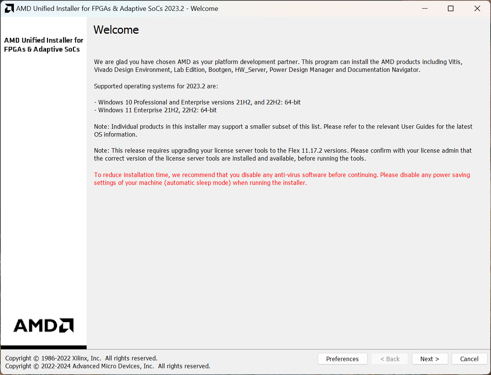
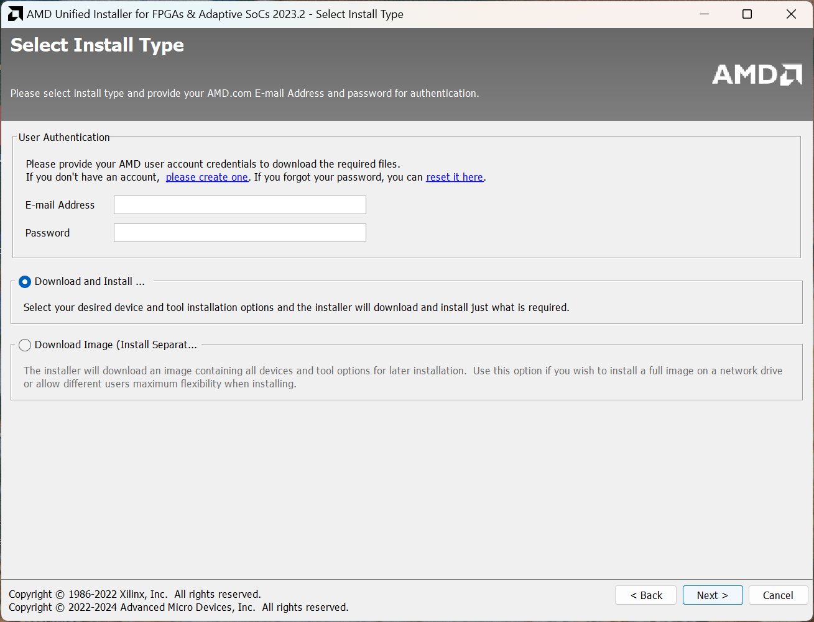
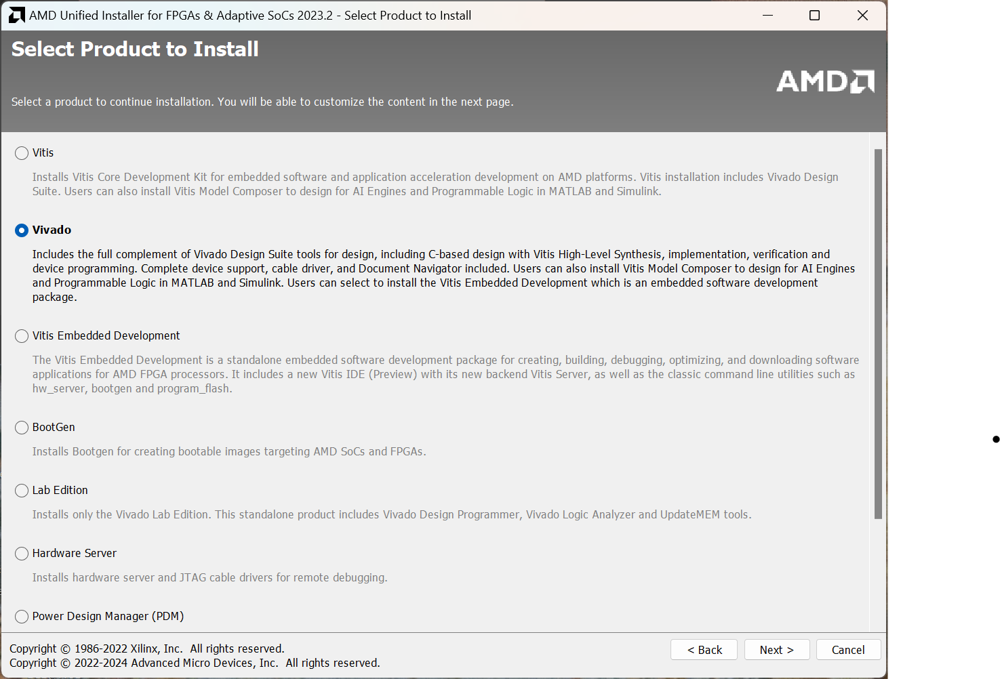
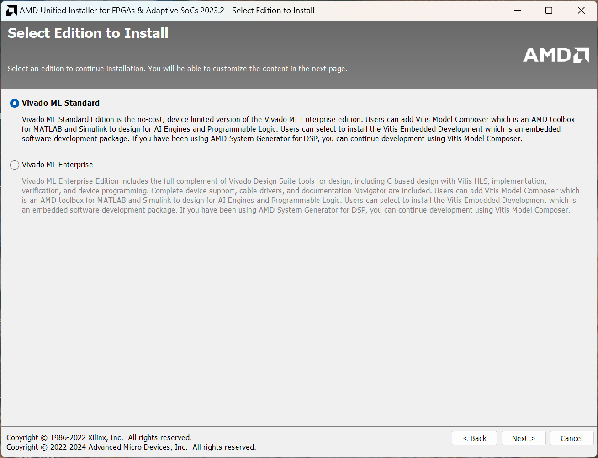
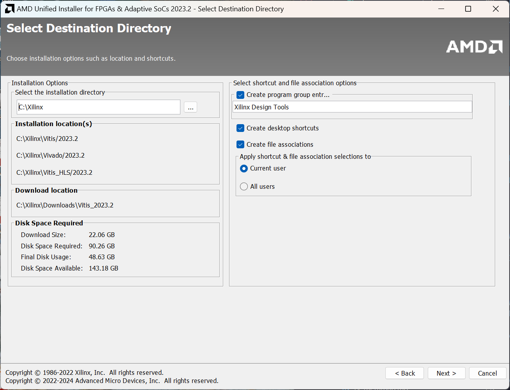
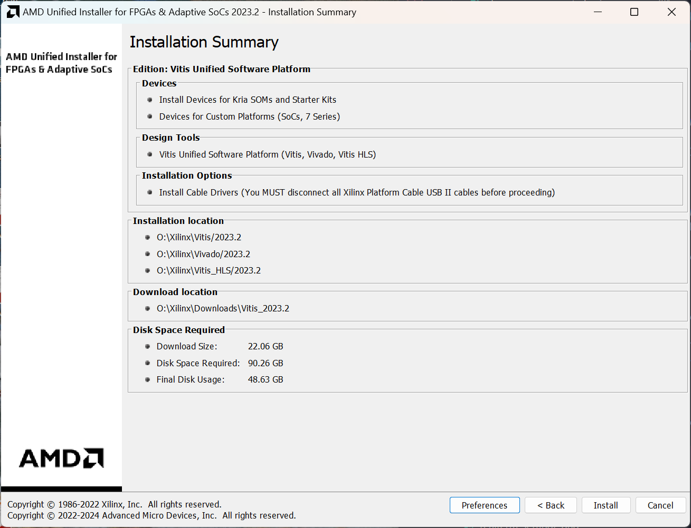

# Installation Guide for Vivado

!!! warning
    Please note that this is the CG3207 website. If you are taking a different course, you may have been directed here for the instructions to install Vivado. 

    Please **DO NOT** get confused, and start doing the labs for CG3207, if you are not taking CG3207. 

For this course, we recommend using Vivado 2023.2. Any other version of Vivado you have installed will probably work; however, you will need support for 7 series FPGAs to be able to use the Nexys 4 board. 

!!! note
    Vivado runs on Windows and Linux, but not on macOS. However, we have recently found that it is possible to run Vivado on a Mac computer using Parallels Desktop. Our test setup was as follows:
    
    * MacBook Pro with M1 Max CPU
    * macOS Sequoia version 15.4
    * Parallels Desktop version 20.2.2, running Windows 11

    Create a virtual machine for Windows 11 on Parallels Desktop, then in that VM, follow the steps for Windows in this guide. To successfully connect your FPGA board to Vivado, you will need to install the latest version of the [Digilent Adept Runtime](https://digilent.com/shop/software/digilent-adept/), as the cable drivers included with Vivado may not install correctly. 

    If you are an NUS student, you may obtain a license for Windows 11 Education from [here](https://portal.azure.com/#blade/Microsoft_Azure_Education/EducationMenuBlade/software). 
    
    We have not (yet) tested Vivado running on a Linux VM (e.g. Ubuntu on Parallels), or using other hypervisors (e.g. VMWare Fusion, QEMU etc.). These setups may work, but are not guaranteed to do so. We understand Parallels Desktop is paid (and not cheap) software, so if you are unable to obtain a license to use it, we recommend either borrowing a laptop/PC from someone you know, or using the lab PCs which have the software preinstalled. 

Download Vivado from [AMD/Xilinx's website](https://www.xilinx.com/support/download/index.html/content/xilinx/en/downloadNav/vivado-design-tools/2023-2.html). We echo AMD's recommendation to download the web installer instead of the full, 100+ gigabyte archive. Download the exe or bin file, depending on your operating system of choice. 

You will need to create an account to download Vivado and fill out a form for US export control regulations. You will also need to enter this information when you install the software. 

## Preparing to install Vivado 

### Windows

You should be running Windows 10 or 11. Xilinx recommends the Pro or Enterprise version of certain specific versions of Windows; however, Vivado runs just fine on any version of 10 or 11. Simply open the downloaded executable file. Make sure you allow it through your firewall when prompted, and note that it may show up as "OpenJDK Platform Binary" executable requesting permission. 

### Linux (Ubuntu, RHEL, etc.)

To install Vivado on Linux, you may first need to install some dependencies. On Ubuntu, these are `libtinfo5` and `libncurses5`. Install these with `sudo apt install libtinfo5 libncurses5`. Some googling will find you the equivalent packages and commands for other distributions like Red Hat/Fedora and Arch. Xilinx officially supports some specific versions of RHEL, CentOS, SLE, Amazon Linux, AlmaLinux and Ubuntu; however, Vivado will probably run on other distributions like Fedora or Arch. 

Additionally, for Linux, the installer will not automatically install cable drivers for you. After you install Vivado, you must follow the following steps:

```
# change directory to your Vivado install, for example:
cd /opt/Xilinx/Vivado/2019.2

# cd into the drivers directory (the script MUST be run there)
cd data/xicom/cable_drivers/lin64/install_script/install_drivers

# run the cable installer with root privileges
sudo ./install_drivers
```
These steps can also be found on [Xilinx support](https://support.xilinx.com/s/article/63794?language=en_US).

To run the installer, first use `chmod u+x filename.bin` to add execute permissions to the downloaded bin file. Remember to replace "filename" with the name/path of the downloaded file. Run it using `sudo ./filename.bin`. 

##

The installer may ask you to install the latest version of Vivado instead. 


Ignore this and click "Continue" instead. 

This will bring you to the Welcome page of the installer, shown below. 



Click "Next" to proceed. 

The installer will now prompt you to enter your username and password you created to authenticate the download. 



Enter your username and password you just created. Make sure you have "Download and Install Now" selected. Click "Next". 

You will now see the following screen, asking you which product you would like to install:



Here, choose Vivado. You will not need Vitis for this course; however, it will be needed for EE4218 and CEG5203, so if you intend to take either course in the future, select Vitis instead. Click "Next". 

Next, you will be prompted for which edition of Vivado you want to install. This prompt will not appear if you chose to install Vitis instead. 



Here, choose the Vivado ML Standard edition. Beware that Vivado ML Enterprise is selected by default. 

Now, you will be prompted to choose which components you want to install. If you are installing only Vivado for CG3207, then make the following selections: 


Make sure Artix-7 (under the 7 Series devices), and the "Install Cable Drivers" option, are checked. 

If you are installing Vitis, and want to install the components you will need later, make the following selections:


Make sure Artix-7 (under the 7 Series devices), and Zynq UltraScale+ MPSoC (under the SoCs) are checked, as well as "Install Devices for Kria SOMs and Starter Kits". Also make sure "Install Cable Drivers" is selected. 

Click "Next" to proceed. You will now be prompted to accept the license agreements for all the products you are installing. 


Check all the "I Agree" checkboxes, and click "Next" again.

The last screen will prompt you for the installation destination and other options. You may choose to stick with the defaults, or change these as per your preference. 



Click "Next" here. The installer will then prompt you to confirm your selections.



Make sure all the options shown are correct for what you're trying to install. Click Install and let the installer run, it may take a while (up to a couple of hours). 

## Next Steps

You may wish to see the [Getting Started manual](https://github.com/NUS-CG3207/lab-manuals/blob/4b14f6d6df9ea91f8b1c5293c303f1fcfeeb5846/getting_started.pdf) which teaches you some of the basics of how to use Vivado and Verilog to create a design for an FPGA. 
