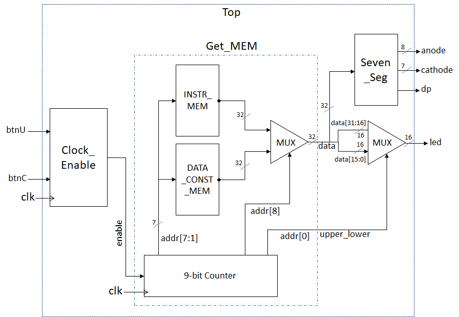

# Assignment 1: Familiarisation with Assembly Language and HDL/FPGA

!!! success "Final"
    This page is now final. Updates will be minimal, and will be highlighted. 

!!! info
    Assignment 1 consists of **2** tasks, worth **5** points each, for a total of **10 points**.

    Assignment 1 is an **individual** exercise. You will work in groups for later labs, but this one must be completed, submitted and demonstrated **individually**.

## Introduction

This assignment is designed to test your prerequisite knowledge for smooth completion of this course. It will walk through some basics of desigining for FPGA hardware,  writing RISC-V code, and how to use your RISC-V code in an FPGA design.

It is **imperative** to put in effort and try your best for this assignment. It may take an amount of effort that is quite disproportionately large, compared to the impact on your grade. This is normal. This assignment is designed to prepare you for the later ones, so that you can spend time debugging your design, instead of debugging your knowledge. 

## Task 0: Getting familiar with FPGAs [0 points]

To comfortably complete Assignment 1 (and 2 and 3 and 4, for that matter), solid familiarity with the FPGA design toolchain is required. Having taken, and understood (at least most of) EE2026 or CS2100DE is sufficient for this level of familiarity.

If you are not confident of your Vivado-wrangling and FPGA-whispering capabilities, you should go to [the CS2100DE website](https://nus-cs2100de.github.io/labs) and attempt Lab 1 through Lab 4.

If you have already read through, and followed the instructions in [Lab Prerequisites](../../getting_started/prereq.md), as you should have done, then congratulations - you are ready for the tasks ahead! If not, now is the time to do so.

This task is not graded, but necessary to be able to complete the assignments meaningfully. Please do not take it lightly.

## Task 1: Assembly simulation [5 points]

### Task overview

The goal of this task is to get familiar with the [RISC-V assembler/simulator](../../rv_resources/rv_programming.md) or [ARM assembler/simulator](../../ARM/arm_programming.md) by simulating a sample program. We will simulate a system with memory-mapped input/output (MMIO).

We assume that the LEDs on this system are mapped to address [`0xFFFF0060`]("`0xC00` for ARM"). This means that when we write to this memory address using [`sw`]("`STR` for ARM"), the least significant 16 bits of whatever data we write to this address is shown on the LEDs. For example, if we write `0xF0F0`, the first four LEDs from the left will be lit, then the next four will be unlit, the next four lit, and the last four unlit.

Similarly, we assume that the DIP switches are mapped to address [`0xFFFF0064`]("`0xC04` for ARM"). This means that when we read data from this memory address using [`lw`]("`LDR` for ARM"), the least significant 16 bits of data read will correspond to the state of the switches. For example, if the switches are alternating between on (up) and off (down), with the first switch from the left being on, the data read will be `0xAAAA`.

### Task instructions

In this task, we will simulate the user providing some input to the switches, and observe the provided assembly program display said input on the LEDs. The first step, of course, is to download the [RISC-V assembly sample](../../code_templates/Asst_01/DIP_to_LED.asm) program or the [ARM assembly sample](../../code_templates/Asst_01/arm_assembly_sample.s) program. Then, we can open our sample file in RARS or Keil MDK and start simulating.

=== "RISC-V (RARS)"

    Refer to [Lab 4 from CS2100DE](https://nus-cs2100de.github.io/labs/manuals/04/lab_04/#getting-started-with-rars) for some help on how to open a RISC-V assembly file in RARS. The guide is written for a different sample program, but the steps to open, assemble and run the code are identical.

    !!! warning
        Remember to set the memory configuration correctly - from "Settings" -> "Memory Configuration", choose "Default". Setting this correctly is **very important** - our simulation for this assignment depends on this memory configuration being selected, and our CPU design later will also assume this memory configuration.
    
    Once you have assembled and begun to run the RISC-V code line-by-line, before executing line 48, simulate changing the input on the switches by modifying the memory at the address mapped to the DIP switches (`0xFFFF0064`). Then, continue running the code, including lines 48 and 49, one line at a time, until the memory at the address for the LEDs (`0xFFFF0060`) changes to reflect the new data. 

    

    /// caption
    
    Screenshot of addresses in RARS

    ///

=== "ARM (Keil MDK)"

    Refer to [the ARM Programming Guide](../../ARM/arm_programming.md) for instructions on how to set up and use Keil MDK. 

    Once you have assembled and begun to run the ARM code line by line, before executing line 23, simulate changing the input on the switches by modifying the memory at the address mapped to the DIP switches (`0xC04`). Then continue running the code, including lines 23 and 24, one line at a time, until the memory at the address for the LEDs (`0xC00`) changes to reflect the new data.

    

    /// caption

    Screenshot of addresses in Keil MDK

    ///

For the assessment, you must be able to demonstrate everything you just did in front of your assessor. You must also understand every line of the sample assembly program, as you may be quizzed on what a particular line (or set of lines) does.

Finally, dump the instruction and data memories. Click the "Dump Memory" button in RARS to do this. We need to dump the "text" (instruction) and "data" sections, using the "Hexadecimal Text" option, and finally choosing to "Dump to File...". Name these with .mem extension and keep them in a safe place to use in the next task.

#### Optional but Recommended
Simulate a 'Hello World' Program. 
There are 2 versions provided - 

* [HelloWorld](../../code_templates/Asst_01/HelloWorld.asm) that doesn't use subroutines and can be done using instructions implemented in Assignment 2,<br>
and
* [HelloWorld_jal_jalr](../../code_templates/Asst_01/HelloWorld_jal_jalr.asm) that uses subroutines and requires full `jal` and `jalr` support.

Since we are using a simulator now and isn't worried about processor capabilities, you can simulate either or both.
Read the UART peripheral details to understand the 4 registers involved.
To simulate it, you need to go to Tools>Keyboard and Display MMIO simulator, and the 'Connect to Program'. The following screenshot will be handy.


Note that if you are single-stepping, you need to give the keyboard inputs at the appropriate time - after the previous keypress has been ready by the program - there is no buffer to store characters if you send them at a rate faster than the program can consume it.

## Task 2: Basic HDL simulation and implementation [5 points]

In this task, we will implement a simple hardware demo, that reads data from two Read-Only Memories (ROMs) and displays them on the seven-segment display on the FPGA. Note that we are **not** (yet) building a CPU, or anything that actually executes the instructions, so what instructions we use is somewhat irrelevant.

### Design specification

The system we will implement looks like this:



/// caption

A block diagram of the system we want to implement

///

`IROM` (`INSTR_MEM` in the figure above) and `DMEM` (`DATA_CONST_MEM` in the figure above) are ROMs with 128 words each. We will use RARS to dump our assembly program into these ROMs, so `IROM` will hold the instructions of the assembly program (in machine code, of course), while `DMEM` will hold the constants and initialised variables we declare in the program. In later assignments, the `DMEM` hardware we implement will be writeable, but for now, we assume that it is not, and hence a 'ROM'. The ROMs are both combinational logic and do not need clocking. Both ROMs are only word-addressable, not byte-addressable.

The `Clock_Enable` block generates an `enable` signal, to be used in tandem with the system clock `clk`. A module using this clock enable should, at every edge of `clk`, check if `enable` is high, and only be enabled if it is. 

`Clock_Enable` takes in the upper and center push buttons as inputs, and uses them as follows:

1. If `btnU` is pressed, `enable` is pulled high every once every 250 milliseconds, and stays high for one clock cycle. 
    
    Example: At t=0 ms, `enable` is high. Then, at the next clock edge, `enable` should be low, and it should remain low until t=250 ms. At t=250 ms, enable should be pulled high. Repeat.  

2. If `btnC` is pressed, `enable` is never pulled high. 

3. If neither `btnU` nor `btnC` are pressed, `enable` is pulled high once every 1000 ms (1 second), and stays high for one clock cycle. 
    
    Example: At t=0 ms, `enable` is high. Then, at the next clock edge, `enable` should be low, and it should remain low until t=1000 ms. At t=1000 ms, enable should be pulled high. Repeat. 

The 9-bit counter is a sequential block. It uses the system clock `clk` and the clock enable signal `enable` to count up a 9-bit number `addr`. That is, for every positive edge of `clk`, if `enable` is high, the counter should increment by 1. `addr` is the only output of this module.

`addr[7:1]` should be used to address both `IROM` and `DMEM`. The ROMs will both output whatever value is present in the address `addr[7:1]`. Then, depending on `addr[8]`, a multiplexer should choose whether to display the instruction memory or the data memory. The output of this multiplexer is `data`.

`data` is connected as an input to `Seven_Seg` directly, and the seven-segment displays will display the value from `data` as a hexadecimal value on the seven-segment display on the board. `Seven_Seg_Nexys` is already created and does not need to be modified or understood at an implementation level.

`data` is also then split into two 16-bit numbers, `data[31:16]` and `data[15:0]`. We use `addr[0]` as a select input to another multiplexer, to choose whether to display the upper or the lower 16 bits on the LEDs.

The sequence of events expected, if no buttons are pressed, is:

1. For one second, the seven-segment displays display the content of `IROM[0]`, while the LEDs show `IROM[0][31:16]`.

2. For one second, the seven segment displays display the content of `IROM[0]`, while the LEDs show `IROM[0][15:0]`.

3. For one second, the seven segment displays display the content of `IROM[1]`, while the LEDs show `IROM[1][31:16]`.

4. For one second, the seven segment displays display the content of `IROM[1]`, while the LEDs show `IROM[1][15:0]`.

5. Repeat until the last instruction in `IROM` is displayed.

6. For one second, the seven-segment displays display the content of `DMEM[0]`, while the LEDs show `DMEM[0][31:16]`.

7. For one second, the seven segment displays display the content of `DMEM[0]`, while the LEDs show `DMEM[0][15:0]`.

8. For one second, the seven segment displays display the content of `DMEM[1]`, while the LEDs show `DMEM[1][31:16]`.

9. For one second, the seven segment displays display the content of `DMEM[1]`, while the LEDs show `DMEM[1][15:0]`.

10. Repeat until the last datum (singular form of "data"!) in `DMEM` is displayed.

11. Start again from step 1.

If `btnU` is pressed, the sequence should be the same, but the interval should be shortened to 250 milliseconds instead of 1 second. The display should not be interrupted or reset, only sped up.

If `btnC` is pressed, the sequence should be paused as long as it is held down, and resume from the same place as soon as it is released.

### Implementation guide

Download the template for Assignment 1 from [the labs file repository](https://github.com/NUS-CG3207/labs/tree/main/docs/code_templates/Asst_01). Choose the files appropriate for your setup - that is, in your language of preference (Verilog or VHDL), and the constraints file corresponding to the FPGA board model you have. Create a new project and import these files, setting the Top module correctly.

!!! tip

    Vivado (like many other IDEs) does not take too kindly to project paths that are too long, contain special/non-English characters, or are in some cloud synchronised folder like OneDrive, Google Drive or Dropbox. All sorts of weird bugs may crop up, which are hard to debug. 

    Vivado projects should ideally be stored in a folder with a short and sweet name, that is not continuously synchronised to the cloud. For backups, collaboration and version control, `git` should be used - whether GitHub, Gitlab or any other implementation.

In total, we will need `Top_Nexys`, `Seven_Seg_Nexys`, `Clock_Enable`, `Get_MEM`, and one `.xdc` file corresponding to our board.

!!! warning
    The Nexys 4 and Nexys 4 DDR/Nexys A7 use the same FPGA chip on board, but the pins are connected differently. Thus, the part number we choose when creating a new project is the same for both (XC7A100T-1CSG324C), however, the constraints file **is different**. Using the wrong constraints file will work for simulation, synthesis, implementation and even bitstream generation - but the bitstream will not work on the board!

We need to fill out `Clock_Enable`, `Get_MEM` and `Top_Nexys` to achieve the functionality described above. 

The hexadecimal text dump should be saved with a `.mem` file extension. These files can be imported into our Vivado project as design sources, and used to initialise memories using the `$readmemh()` command. 

Do **NOT** use a clock divider, like you may have used in EE2026. They can cause all sorts of issues, since it becomes difficult for the synthesis tool to route the clocks. 

### How to design a clock enable

Here is some example code that may help better illustrate how a clock enable should be implemented. This is just an example, not necessarily something you will be able to just copy/paste and use; but it should give you an idea of how it should be implemented. 

Do **either** of the two depending on your situation. Else, you might have to wait for **2^26 cycles** (for a ~1Hz clock) before you can see the effect of 1 clock edge in simulation! This will take a long long time, and is really unnecessary in the simulation. 

=== "Verilog"
    ```verilog
    always @(posedge clk) begin
        count_fast <= count_fast+1;
        if(count_fast == 26'h3FFFFFF) begin // EITHER change this to a lower value (say 26'h0000004) for simulation
            count_slow_enable <= 1'b1;
        end
        else begin
            count_slow_enable <= 1'b0; // OR change this to 1'b1 for simulation
        end
    end

    always @(posedge clk) begin
        if(count_slow_enable) begin
            count <= count+1;
        end
    end 
    ```
=== "VHDL"
    ```VHDL
    process(clk)
        variable count_fast :std_logic_vector(25 downto 0):=(others=>'0');
    begin
        if clk'event and clk='1' then
            count_fast := count_fast+1;
            if count_fast = x"3FFFFFF" then -- EITHER change this to a lower value (say x"0000004") for simulation
                count_slow_enable <= '1';
            else
                count_slow_enable <= '0'; -- OR change this to '1' for simulation;
            end if;
        end if;
    end process;
    
    process(clk)
    begin
        if clk'event and clk='1' then 
            if count_slow_enable = '1' then
                count <= count+1;
            end if;
        end if;
    end process; 
    ```

### Simulation

Simulation is required for this assignment, but nothing too complicated - a simple simulation of the `Top_Nexys` module will suffice. The simulation should cover all possible input cases. Needless to say, the simulation should be show the correct result!

Feel free to make your simulation more rigorous by automatically checking test cases, and using $error() to halt the simulation if any don't pass. This is not required, but will make for an impressive demo. 

!!! warning
    Do not move on to the next step without writing a good simulation, and making sure the design can pass it! If the simulation doesn't work, there is no chance the hardware will. However, if the simulation does work, the hardware is almost guaranteed to work too. The most common reason for designs that work in simulation not to work on hardware is mistakes in the constraints file, or faulty hardware. 

### Implementation

Before starting the implementation process, remember to set up the constraints file correctly. Uncomment the lines corresponding to the pins used - no more, no less. Make sure the names in the constraints file match the inputs and outputs of the `Top_Nexys` module. Then, run Synthesis, Implementation and Generate Bitstream to generate the bitstream to upload to your board. 

## Tips

* Chapter 2 from the lecture notes contains important design guidelines - these should be followed religiously. In particular, Chapter 2B explains how to write synthesisable HDL code, which is very useful for making designs that work optimally and as intended.
* Clock enables should be used if the clock needs only be active in certain situations. Clock dividers should be avoided.
* Instead of making the whole design in one go and praying that it synthesises correctly, we can always set individual modules as Top and synthesise one by one. This makes errors and bugs much easier to detect and solve.
* "View Elaborated Design" -> "Schematic" is a very powerful tool to visualise the circuit generated. Liberal use of the schematic can help prevent bugs and unexpected design oddities.
* Similarly, the synthesis report can contain some hints on where things are going wrong. We can check to see if the primitives being inferred make sense for our design.
* Vivado's text editor is, perhaps, not the greatest ever made. We recommend using a more cromulent alternative, such as [Notepad++](https://notepad-plus-plus.org/) or [Visual Studio Code](https://code.visualstudio.com/).
* Writing good HDL code is a skill that takes a lot of practice. It is a completely different paradigm to (and should **never ever** be confused with) software programming. The best teacher is experience, and practice really does help. Following the guidelines from Chapter 2, and being very conscious about the hardware we expect our code to generate, is key.
* For this design, debouncing the switches is really quite extra and not necessary. (Why?) Feel free to look into a [metastable filter](https://en.wikipedia.org/wiki/Metastability_(electronics)), although it is also unnecessary for this design.

## Submission and demonstration instructions

### Submission

Once you have finished the assignment, you must submit your work to Canvas. You should submit **a single zip file**. The file should contain:

1. The assembly language program (ending with `.s` or `.asm`), if you have modified it. If not, skip this one. 
2. The HDL sources for your project, i.e. all of the `.v`/`.vhd`/`.sv` files for modules, testbenches, etc.
3. The `.xdc` constraints file.
4. The `.bit` bitstream file.
5. A screenshot of the simulation waveform as a `.jpg` file. All of the signals in the design should be captured - there aren't that many, so they should fit on your screen. If you need to use multiple screenshots to make it clear, feel free to do so. 

Your submission must be made to Canvas before the start of your lab session in Week 5. The exact deadline for your submission will be visible on Canvas. 

### Demonstration

Before your lab session in Week 5, you will be assigned a time slot of 7 minutes for your demonstration. 

Arrive at the lab at least 30 minutes before your assigned time slot. If you are one of the earlier time slots, you need not arrive more than 15 minutes before the start of the lab timing (i.e. before 17:45 or 08:45). 

The time will be split as follows:

* 2 minutes to demonstrate Task 1, using RARS. You should show that you are able to follow the instructions in Task 1. 
* 2 minutes to demonstrate Task 2, on the FPGA board. You should show that the design specified for Task 2 is implemented correctly with all features functional.
* 3 minutes for two questions from the GA assessing you.

The time is extremely tight - with so many of you, we do have to be quick :3. If you are not there when we are ready to assess you, we will skip past you and start assessing others. You will be bumped to the bottom of the queue, and we will not assess you until everyone else is done. (On the flip side, if you are nice and early, and someone misses their turn - good news, you might get to go home early :D)

Note that you will **not** have extra time to open programs, load projects, etc.. Make sure you have opened RARS and Vivado, and have the bitstream ready to upload to your board. Any extra time you take to do these tasks will eat into the time for the demonstration. We will not exceed your allotted time for demonstration.

### Penalties for late submission

Late submissions and demonstrations up to one week will be allowed, with a penalty of 50%. Beyond one week, submissions will not be accepted. 

This policy is non-negotiable, aside from the usual NUS clauses such as being unwell (Medical Certificate strictly required), authorised competitions, family emergencies etc. 

## Conclusion

Congratulations! With the first assignment finished, we are now comfortable with FPGA design and assembly programming. We are ready to dive into the proper content of the course. In the next assignment, we will have our CPU up and running - it's going to be exciting.

!!! success "What we should know"
    * How to write and simulate RISC-V assembly programs.
    * How to use MMIO in our RISC-V assembly programs to control peripherals.
    * How to use Vivado to create a design for the FPGA board.
    * How to translate a block diagram into an implemented design for FPGA.
