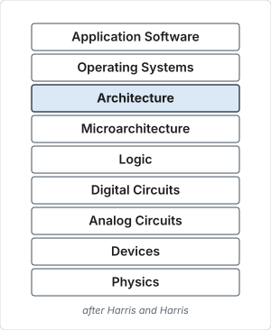

# Background

## Recap: architecture vs microarchitecture

**Architecture (ISA): the programmer's view of a computer.**

- Defined by instructions & operand locations.
- *Assembly language*: human-readable format of instructions.
- *Machine language*: computer-readable format (1's and 0's).
- Assembly language → machine language conversion is done by the **assembler**.
    - One-to-one correspondence (except for pseudo-instructions).

<figure markdown="1">
{ width="300" }
<figcaption>Levels of abstraction. After Harris and Harris.</figcaption>
</figure>

**Microarchitecture: how to implement an architecture in hardware.**

## RISC-V history

- Began in **2010** at the University of California, Berkeley as a short project.
- Goal: to make a practical ISA that was open-sourced, usable academically, and
  deployable in any hardware or software design without royalties.
- Introduced in **Aug 2014**.
- Transferred to the RISC-V Foundation in **2015**, and then on to RISC-V
  International, a Swiss non-profit entity, in **November 2019**.
- Fast gaining traction — numerous open source as well as commercial
  implementations.
- Software support improving fast.

## Notable products and software

- ESP32-C3, ESP32-C6. ESP32-S series also have ultra-low-power cores which are
  RISC-V based, though the main processors are Xtensa based.
- Raspberry Pi Pico 2, Microchip FPGAs/SoCs.
- Modern Nvidia GPUs and large processor chips include dozens of embedded
  NV-RISCV management cores.
- Many implementations and commercial products —
  [see the list on Wikipedia](https://en.wikipedia.org/wiki/RISC-V#Implementations).
- Many hardware accelerators built around RISC-V cores.
- Mainline support for RISC-V ISA was added to the Linux kernel in **2022**.
- In **July 2023**, RISC-V, in its 64-bit variant called `riscv64`, was included
  as an official architecture by Debian.

## RISC-V features

- As a RISC architecture, the RISC-V ISA is a **load–store architecture** — only
  load/store variants can access memory.
    - No mixing of memory access with data processing or branching.
- Interesting design choices to simplify hardware implementation.
    - Especially the encoding of immediates.
- **Modular design** — the instruction set is designed for a wide range of uses.
- The base instruction set has a fixed length of 32-bit naturally aligned
  instructions (different base variants such as RV32I, RV32E, RV64I, … exist).
- The ISA supports variable length extensions where each instruction can be any
  number of 16-bit parcels in length.
- Extensions include multiplication (**M**), floating point (**F**, **D**,
  **Q**), atomics (**A**), compressed instructions (**C** — 16-bit long
  instructions for high code density like ARM Thumb), …

!!! note

    Instruction lengths and word lengths are not necessarily the same.

## RISC-V base instructions

=== "Data Processing (DP)"

    To process data.

    - **register**: `add`, `sub`, `or`, `xor`, `and`, `sll`, `srl`, `sra`,
      `slt`, `sltu`
    - **immediate**: `addi`, `ori`, `xori`, `andi`, `slli`, `srli`, `srai`,
      `slti`, `sltiu`
    - **upper immediate**: `lui` (load upper immediate), `auipc` (add upper
      immediate to pc)

=== "Memory"

    To access memory.

    - **offset mode**: `lw`, `lh`, `lb`, `lhu`, `lbu`, `sw`, `sh`, `sb`
    - No data processing. No pre/post index addressing.

=== "Branch / Jump"

    To change control flow.

    - **Branch** (conditional, no link): `beq`, `bne`, `blt`, `bge`, `bltu`,
      `bgeu`
    - **Jump** (unconditional, with link): `jal`, `jalr`

=== "Others"

    Special purpose instructions.

    - `ecall` (system call), `ebreak` (breakpoint), `fence` (memory barrier)
