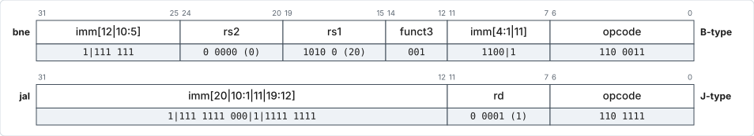

# Control (Branch/Jump) Instructions

## Instruction table

| Inst   | Name              | FMT | Opcode    | funct3 | Description (C)                | Syntax                 |
| ------ | ----------------- | --- | --------- | ------ | ------------------------------ | ---------------------- |
| `beq`  | Branch ==         | B   | `1100011` | `0x0`  | `if(rs1 == rs2) PC += imm`     | `op rs1, rs2, LABEL`*  |
| `bne`  | Branch !=         | B   | `1100011` | `0x1`  | `if(rs1 != rs2) PC += imm`     | `op rs1, rs2, LABEL`*  |
| `blt`  | Branch <          | B   | `1100011` | `0x4`  | `if(rs1 < rs2) PC += imm`      | `op rs1, rs2, LABEL`*  |
| `bge`  | Branch ≥          | B   | `1100011` | `0x5`  | `if(rs1 >= rs2) PC += imm`     | `op rs1, rs2, LABEL`*  |
| `bltu` | Branch < (U)      | B   | `1100011` | `0x6`  | `if(rs1 < rs2) PC += imm`      | `op rs1, rs2, LABEL`*  |
| `bgeu` | Branch ≥ (U)      | B   | `1100011` | `0x7`  | `if(rs1 >= rs2) PC += imm`     | `op rs1, rs2, LABEL`*  |
| `jal`  | Jump And Link     | J   | `1101111` |        | `rd = PC+4; PC += imm`         | `jal rd, LABEL`*       |
| `jalr` | Jump And Link Reg | I   | `1100111` | `0x0`  | `rd = PC+4; PC = rs1 + imm`    | `jalr rd, imm(rs1)`    |

\* Specify the BTA as a LABEL and the assembler will encode the immediate.

- `ltu` (less than unsigned) = LO (lower); `geu`
  (greater or equal unsigned) = HS (higher or same).
    - Other conditions such as `gt` (GT), `le`
      (LE), `gtu` (HI), `leu`
      (LS) can be achieved by swapping the comparands,
      as they can only be registers, not immediates.

## Encoding of the target

- Branches (conditional) and `jal` (unconditional) encode the offset of the
  target address (a PC-relative label) **from PC** (not PC+8 or PC+4).
- RISC-V allows variable-length instructions but requires instruction lengths to
  be multiples of 16 bits, i.e. offsets are multiples of 2 → **LSB is 0 and is
  not encoded explicitly**.
- The byte address offset is `{imm[12:1], 1'b0}` for branch, `{imm[20:1], 1'b0}`
  for `jal`.
- `jal` can jump by a larger total range (2²¹ bytes, i.e. 2²⁰ half-words) from
  PC than is possible with conditional branches (2¹³ bytes, i.e. 2¹² half-words)
  — half of this to either side of PC.

## The two jump variants

- `jalr` (I format) is *jump and link register*, which is similar to
  BLX (branch target in a register) but allows for an
  offset from the base register.
- `jal` (J format) is *jump and link*, which is similar to unconditional
  BL (branch target is a PC-relative label).
- Unlike BL / BLX
  instructions, the register where the return address (link, i.e. PC+4) is
  stored has to be **explicitly specified as `rd`** (for both `jal`, `jalr`).
    - Conventionally, `ra` (`x1`) — return address — is used
      (pseudoinstruction `call`).
- If no return address needs to be stored, `rd` is set to `x0`. For example:
    - when returning from functions using `jalr` (pseudoinstruction `ret`);
    - when using `jal` for purposes other than calling a function
      (pseudoinstruction `j J_BTA`).
- Conditional branches (`b*`) do not allow for saving of return address.

## Branch/jump instruction example

| Memory Address | Pseudoinstruction / Assembler Directive | Actual Instruction | Operation | Actual Memory Location Content (Instruction in Hex) |
| -------------- | --------------------------------------- | ------------------ | --------- | --------------------------------------------------- |
| `0x00000000` | `J_BTA: li s1, 1`   | `addi x9, x0, 1`      | `x9 = x0 + 1 = 1`                                        | `0x00100493` |
| `0x00000004` | `SB_BTA: li s2, -2` | `addi x18, x0, 0xffe` | `x18 = x0 + 0xfffffffe = 0xfffffffe`                     | `0xffe00913` |
| `0x00000008` | `slt s4, s1, s2`    | `slt x20, x9, x18`    | `x20 = x9 < x18? 1:0` (signed comparison) `x20 = 1 < -2? 1:0 = 0` | `0x0124aa33` |
| `0x0000000C` | `bne s4, zero, SB_BTA` | `bne x20, x0, 0xfffffff8` | `PC = (x20!=x0)? PC+0xfffffff8 : PC+4` `PC = (0!=0)?(0x0000000C + 0xfffffff8) : (0x0000000C + 4) = 0x00000010` Branch won't be taken in this example | `0xfe0a1ce3` |
| `0x00000010` | `jal J_BTA` | `jal x1, 0xfffffff0` | `PC = PC+0xfffffff0 = (0x00000010 + 0xfffffff0) = 0x00000000` `x1 = PC+4 = 0x00000014` | `0xff1ff0ef` |

!!! note "On specifying the target"

    For `bne`: the BTA is specified as a LABEL. The byte offset, i.e.
    `{imm[12:1], 0}`, can be specified directly but is not usually done. The
    same applies to `jal`, where the byte offset is `{imm[20:1], 0}`.

!!! note "On `rd` for `jal`"

    If `rd` is not specified, the assembler will generate code for `rd = ra`/`x1`.
    `j J_BTA` sets `rd = x0`.

<figure markdown="1">

<figcaption>Encodings of <code>bne</code> (B-type) and <code>jal</code> (J-type), showing the scrambled immediate fields.</figcaption>
</figure>
