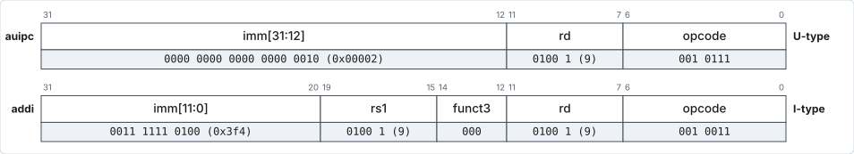

# Data Processing Instructions

## Instruction table

| Inst    | Name                    | FMT | Opcode    | funct3 | funct7            | Description (C)          | Syntax           |
| ------- | ----------------------- | --- | --------- | ------ | ----------------- | ------------------------ | ---------------- |
| `add`   | ADD                     | R   | `0110011` | `0x0`  | `0x00`            | `rd = rs1 + rs2`         | `op rd, rs1, rs2`  |
| `sub`   | SUB                     | R   | `0110011` | `0x0`  | `0x20`            | `rd = rs1 - rs2`         | `op rd, rs1, rs2`  |
| `xor`   | XOR                     | R   | `0110011` | `0x4`  | `0x00`            | `rd = rs1 ^ rs2`         | `op rd, rs1, rs2`  |
| `or`    | OR                      | R   | `0110011` | `0x6`  | `0x00`            | <code>rd = rs1 &#124; rs2</code>        | `op rd, rs1, rs2`  |
| `and`   | AND                     | R   | `0110011` | `0x7`  | `0x00`            | `rd = rs1 & rs2`         | `op rd, rs1, rs2`  |
| `sll`   | Shift Left Logical      | R   | `0110011` | `0x1`  | `0x00`            | `rd = rs1 << rs2`        | `op rd, rs1, rs2`  |
| `srl`   | Shift Right Logical     | R   | `0110011` | `0x5`  | `0x00`            | `rd = rs1 >> rs2`        | `op rd, rs1, rs2`  |
| `sra`   | Shift Right Arith       | R   | `0110011` | `0x5`  | `0x20`            | `rd = rs1 >> rs2`        | `op rd, rs1, rs2`  |
| `slt`   | Set Less Than           | R   | `0110011` | `0x2`  | `0x00`            | `rd = (rs1 < rs2)?1:0`   | `op rd, rs1, rs2`  |
| `sltu`  | Set Less Than (U)       | R   | `0110011` | `0x3`  | `0x00`            | `rd = (rs1 < rs2)?1:0`   | `op rd, rs1, rs2`  |
| `addi`  | ADD Immediate           | I   | `0010011` | `0x0`  |                   | `rd = rs1 + imm`         | `op rd, rs1, imm`  |
| `xori`  | XOR Immediate           | I   | `0010011` | `0x4`  |                   | `rd = rs1 ^ imm`         | `op rd, rs1, imm`  |
| `ori`   | OR Immediate            | I   | `0010011` | `0x6`  |                   | <code>rd = rs1 &#124; imm</code>        | `op rd, rs1, imm`  |
| `andi`  | AND Immediate           | I   | `0010011` | `0x7`  |                   | `rd = rs1 & imm`         | `op rd, rs1, imm`  |
| `slli`  | Shift Left Logical Imm  | I   | `0010011` | `0x1`  | `imm[11:5]=0x00`  | `rd = rs1 << imm[4:0]`   | `op rd, rs1, imm`  |
| `srli`  | Shift Right Logical Imm | I   | `0010011` | `0x5`  | `imm[11:5]=0x00`  | `rd = rs1 >> imm[4:0]`   | `op rd, rs1, imm`  |
| `srai`  | Shift Right Arith Imm   | I   | `0010011` | `0x5`  | `imm[11:5]=0x20`  | `rd = rs1 >> imm[4:0]`   | `op rd, rs1, imm`  |
| `slti`  | Set Less Than Imm       | I   | `0010011` | `0x2`  |                   | `rd = (rs1 < imm)?1:0`   | `op rd, rs1, imm`  |
| `sltiu` | Set Less Than Imm (U)   | I   | `0010011` | `0x3`  |                   | `rd = (rs1 < imm)?1:0`   | `op rd, rs1, imm`  |
| `lui`   | Load Upper Imm          | U   | `0110111` |        |                   | `rd = imm << 12`         | `lui rd, imm`      |
| `auipc` | Add Upper Imm to PC     | U   | `0010111` |        |                   | `rd = PC + (imm << 12)`  | `auipc rd, imm`    |

- Differences with ARM: EOR ⇒ `xor`,
  ORR ⇒ `or`, LSL ⇒ `sll`,
  LSR ⇒ `srl`, ASR ⇒ `sra`.
- Shifts are **real instructions**, not variants of MOV
  unlike ARM. Rotate is not supported in RV32I.
- Shift by an immediate makes use of `imm[10]` (same bit as `funct7[5]`, which is
  `Instr[30]`) to distinguish between logical and arithmetic right shifts. This
  is OK since shift needs only 5 bits of `imm`.

## DP instruction example

- Arithmetic/logical instructions with immediates as the second operand have the
  suffix `i` (for example, `add` for register type, `addi` for immediate type).
    - Opcodes for `add` and `addi` are different too.
- `sub` **cannot take immediates**.
    - This is fine as the immediate is signed — we can simply use the negative
      of the value to be subtracted (known at assembly time) as the immediate
      for `addi`. `A-B = A+(-B)`.
    - Also, `funct7[5]`, which is used to distinguish between `add` and `sub`
      for register type, is not available for immediate type.

| Pseudoinstruction / Assembler Directive | Actual Instruction | Operation                    | Actual Memory Location Content (Instruction in Hex) |
| --------------------------------------- | ------------------ | ---------------------------- | --------------------------------------------------- |
| `mv s2, s1`                             | `add x18, x0, x9`  | `x18 = x0 + x9` ⇒ `x18 = x9` | `0x00900933`                                        |

<figure markdown="1">

<figcaption>R-type encoding of <code>add x18, x0, x9</code>.</figcaption>
</figure>

!!! note

    Most assemblers will implement `mv s2, s1` as `addi x18, x9, 0`, unlike RARS.

!!! note

    `sub` is still needed as the value of the second operand (B) is variable,
    i.e. not known at assembly-time and hence can't be pre-negated.

## DP pseudoinstruction — `li`

- `la` (load address) / `li` (load immediate) are pseudoinstructions that are
  **not 'load' in the strict sense** of the word — no data memory access is
  involved.
- 32-bit constants and absolute addresses (e.g. for MMIO) are generated using
  `li`, which is implemented using `lui` and `addi`, without data memory access
  — 20 bits from `lui` and 12 bits from `addi` together form the 32 bits.
- When `li` is used with small (12-bit) constants, it translates to `addi`
  alone; similar to MOV.
- In contrast, in ARM, 32-bit addresses / constants are loaded from memory using
  the pseudoinstruction LDR Rx, =CONST_32/ADDRESS_32,
  which in turn is implemented as a PC-relative LDR and
  an assembler directive.

| Pseudoinstruction / Assembler Directive | Actual Instruction  | Operation                                            | Actual Memory Location Content (Instruction in Hex) |
| --------------------------------------- | ------------------- | ---------------------------------------------------- | --------------------------------------------------- |
| `li s1, 0x4321dcba`                     | `lui x9, 0x0004321e` | `x9 = 0x0004321e << 12 = 0x4321e000`[^msb]           | `0x4321e4b7`                                        |
|                                         | `addi x9, x9, 0xcba` | `x9 = x9 + 0xfffffcba`[^msb] `= 0x4321dcba`          | `0xcba48493`                                        |

[^msb]: The `0xfffff` prefix to `0xcba` is the result of MSB-extension.
    `0xfffff` is -1, which is why the immediate for `lui` is `0x0004321e` to
    compensate.

## DP pseudoinstruction — `la`

- 32-bit PC-relative addresses (`la`) are generated using `auipc` (facilitating
  position-independent code) and `addi`. 20 bits from `auipc` added to the most
  significant 20 bits of the PC, and 12 bits from `addi` make it 32-bits.

| Memory Address | Pseudoinstruction / Assembler Directive | Actual Instruction   | Operation                                                                   | Actual Memory Location Content (Instruction in Hex) |
| -------------- | --------------------------------------- | -------------------- | --------------------------------------------------------------------------- | --------------------------------------------------- |
| `0x00000010`   | `la s1, LABEL`                          | `auipc x9, 2`        | `x9 = PC + imm<<12 = 0x00000010 + 2<<12 = 0x00002010`                        | `0x00002497`                                        |
| `0x00000014`   |                                         | `addi x9, x9, 0x3f4` | `x9 = x9 + MSB-extend(0x3f4)` ⇒ `x9 = x9 + 0x000003f4` (since imm is positive) `= 0x00002404` | `0x3f448493`               |
| `0x00002404`   | `LABEL: .word 0xABCD1234`               | N.A.                 | N.A.                                                                        | `0xABCD1234`                                        |

<figure markdown="1">

<figcaption>Encodings of <code>auipc x9, 2</code> (U-type) and <code>addi x9, x9, 0x3f4</code> (I-type).</figcaption>
</figure>

Laid out in memory (least significant byte in the lowest memory address —
little-endian scheme):

| Memory Address                | `0x00000010` | `0x00000011` | `0x00000012` | `0x00000013` | `0x00000014` | `0x00000015` | `0x00000016` | `0x00000017` |
| ----------------------------- | ------------ | ------------ | ------------ | ------------ | ------------ | ------------ | ------------ | ------------ |
| Actual Memory Location Content | `0x97`       | `0x24`       | `0x00`       | `0x00`       | `0x93`       | `0x84`       | `0x44`       | `0x3f`       |

## Multiply and divide

Multiply and Divide are **not a part of the base instruction set**, but are
available as an optional standard extension (**M**).

| Inst     | Name              | FMT | Opcode    | funct3 | funct7 | Description (C)              | Syntax            |
| -------- | ----------------- | --- | --------- | ------ | ------ | ---------------------------- | ----------------- |
| `mul`    | MUL               | R   | `0110011` | `0x0`  | `0x01` | `rd = (rs1 * rs2)[31:0]`     | `op rd, rs1, rs2` |
| `mulh`   | MUL High          | R   | `0110011` | `0x1`  | `0x01` | `rd = (rs1 * rs2)[63:32]`    | `op rd, rs1, rs2` |
| `mulhsu` | MUL High (S) (U)  | R   | `0110011` | `0x2`  | `0x01` | `rd = (rs1 * rs2)[63:32]`    | `op rd, rs1, rs2` |
| `mulhu`  | MUL High (U)      | R   | `0110011` | `0x3`  | `0x01` | `rd = (rs1 * rs2)[63:32]`    | `op rd, rs1, rs2` |
| `div`    | DIV               | R   | `0110011` | `0x4`  | `0x01` | `rd = rs1 / rs2`             | `op rd, rs1, rs2` |
| `divu`   | DIV (U)           | R   | `0110011` | `0x5`  | `0x01` | `rd = rs1 / rs2`             | `op rd, rs1, rs2` |
| `rem`    | Remainder         | R   | `0110011` | `0x6`  | `0x01` | `rd = rs1 % rs2`             | `op rd, rs1, rs2` |
| `remu`   | Remainder (U)     | R   | `0110011` | `0x7`  | `0x01` | `rd = rs1 % rs2`             | `op rd, rs1, rs2` |

- There are no instructions like SMULL,
  UMULL of ARM which update two registers, as only one
  register can be written by an instruction.
    - To get a 64-bit result from multiplying two 32-bit numbers, we have to use
      `mul` **and** `mulh`/`mulhu`/`mulhsu` (depending on the signedness of the
      multiplicand and multiplier) for the least and most significant 32 bits
      respectively.
    - Note that the signedness of the operand does not affect the least
      significant 32 bits of the multiplication result.
    - `mulhsu` is a somewhat unique instruction not found in most other ISAs,
      allowing for a signed number to be multiplied with an unsigned number —
      useful for multi-word arithmetic.
