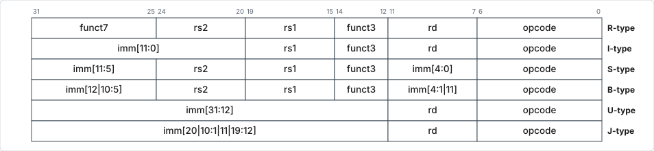
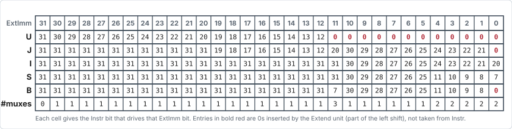

# Instruction Formats

!!! info "Comparison with ARM"

    This is different from ARM, which has basically 3 formats: one for each
    category — DP (which has 3 sub-variants: DP Imm, DP reg shifted imm, DP reg
    shifter reg), Memory, and Branch.

## The six base formats

- **R** (register: DP register)
- **I** (immediate: DP immediate, load — `lw`, `jalr`)
- **S** (store: `sw`)
- **B**, also referred to as SB (short branch: `beq`, `bne`, `bge`, `blt`,
  `bgeu`, `bltu`)
- **U** (upper: `lui`, `auipc`)
- **J**, also referred to as UJ (upper jump: `jal`)

<figure markdown="1">
<div class="wide-figure" markdown="1">

</div>
<figcaption>R, I, S, B, U and J type instruction formats.</figcaption>
</figure>

- The **opcode field occupies the least significant part** of the instruction,
  and RISC-V uses a little-endian format.
    - This allows for the instruction type to be determined just by looking at
      the first byte alone (which occupies the lower memory address in
      little-endian).
- `rs1`, `rs2`, and `rd` bit positions are **standardized across formats**.
    - Saves some multiplexers.

## Immediates

- All immediates are **MSB-extended** — this implies sign-extension in almost
  all cases (but is a bit non-intuitive for `sltu`, where an unsigned number
  like `0xFFFFFFF8` is encoded as an immediate `0xFF8`).

!!! tip "Syntax"

    Immediates in RISC-V assembly are **not** written with a `#` sign in front,
    unlike ARM.

Partial Verilog code for the Extend unit illustrates the commonalities that
allow for hardware simplicity — saves muxes:

```verilog
ExtImm <= { Instr[31:20], Instr[19:12], 11'h000, 1'b0} ;                                    // U
ExtImm <= {{12{Instr[31]}}, Instr[19:12], Instr[20], Instr[30:25], Instr[24:21], 1'b0} ;    // J
ExtImm <= {{20{Instr[31]}}, Instr[31], Instr[30:25], Instr[24:21], Instr[20]} ;             // I
ExtImm <= {{20{Instr[31]}}, Instr[31], Instr[30:25], Instr[11:8],  Instr[7]} ;              // S
ExtImm <= {{20{Instr[31]}}, Instr[7],  Instr[30:25], Instr[11:8],  1'b0} ;                  // B
```

<figure markdown="1">
<div class="wide-figure" markdown="1">

</div>
<figcaption>Which <code>Instr</code> bit drives each <code>ExtImm</code> bit, and the number of muxes that results.</figcaption>
</figure>

!!! note

    Those shown in bold (red) are 0s inserted by the Extend unit (as a part of a
    left shift), not coming directly from `Instr` bits.
