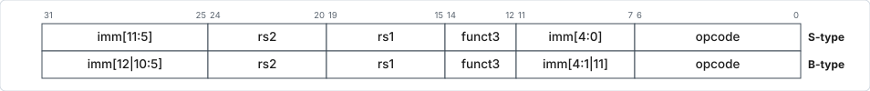
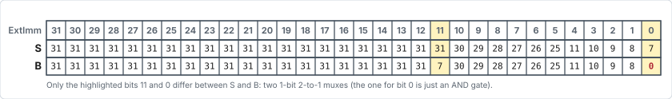
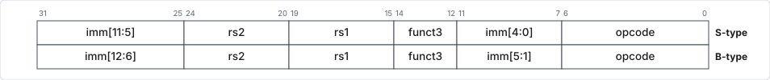
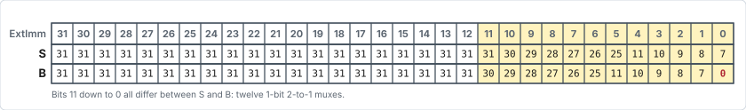

# Format for S and B — ISA Designer's Dilemma

!!! info

    Similar considerations / trade-offs are present for other formats too. S and
    B are used just for illustration.

## The constraints

- **Store** requires byte-level addressability to support `sb`, unaligned `sw`
  and `sh`. Hence, the least significant bit of the offset is relevant.
- **PC is always half-word aligned**, so the least significant bit of the byte
  address offset is 0 and need not be represented.

## Option 1 — same format for S and B

- Simple in every sense, but a lost opportunity to branch to farther
  instructions.

## Option 2 — the RISC-V designers' choice

Different immediate formats — 'strange' looking for B.

<figure markdown="1">

<figcaption>Option 2: the actual RISC-V S-type and B-type layouts.</figcaption>
</figure>

<figure markdown="1">

<figcaption>Only two bit positions differ between S and B.</figcaption>
</figure>

- **Cost:** incurs two 1-bit 2-to-1 muxes for bits 11 and 0, and possibly 1
  extra control (`ImmSrc`) bit from the control unit. Actually, the mux for bit
  0 is simply an AND gate (why?). Total cost: a few gates extra.
- **Benefit:** provides 2× the range of offset for B (i.e. can branch to farther
  BTAs).

## Option 3 — a more 'regular' format

Here `12:1` for B occupies the bits occupied by `11:0` for S.

<figure markdown="1">

<figcaption>Option 3: a hypothetical, more regular B-type layout.</figcaption>
</figure>

<figure markdown="1">

<figcaption>Under option 3, twelve bit positions differ between S and B.</figcaption>
</figure>

- **Cost:** incurs 12 1-bit 2-to-1 muxes. Extra control (`ImmSrc`) bit from the
  control unit, similar to option 2. Total cost: many tens of gates extra.
- Machine code more readable, possibly slightly reduced assembler effort
  compared to option 2 (not really a practical consideration).
- **Benefit:** provides 2× the range of offset for B (i.e. can branch to farther
  BTAs), similar to option 2.

!!! success "Comparing options 2 and 3"

    Recapping the two bullet lists above: both options provide the same 2× range
    of offset for B. Option 2 costs a few gates extra; option 3 costs many tens
    of gates extra.
