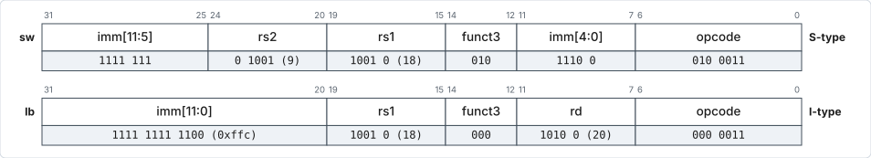

# Memory Instructions

## Instruction table

| Inst  | Name          | FMT | Opcode    | funct3 | Description (C)                    | Syntax             |
| ----- | ------------- | --- | --------- | ------ | ---------------------------------- | ------------------ |
| `lb`  | Load Byte     | I   | `0000011` | `0x0`  | `rd = M[rs1+imm][7:0]`             | `op rd, imm(rs1)`  |
| `lh`  | Load Half     | I   | `0000011` | `0x1`  | `rd = M[rs1+imm][15:0]`            | `op rd, imm(rs1)`  |
| `lw`  | Load Word     | I   | `0000011` | `0x2`  | `rd = M[rs1+imm][31:0]`            | `op rd, imm(rs1)`  |
| `lbu` | Load Byte (U) | I   | `0000011` | `0x4`  | `rd = M[rs1+imm][7:0]`             | `op rd, imm(rs1)`  |
| `lhu` | Load Half (U) | I   | `0000011` | `0x5`  | `rd = M[rs1+imm][15:0]`            | `op rd, imm(rs1)`  |
| `sb`  | Store Byte    | S   | `0100011` | `0x0`  | `M[rs1+imm][7:0] = rs2[7:0]`       | `op rs2, imm(rs1)` |
| `sh`  | Store Half    | S   | `0100011` | `0x1`  | `M[rs1+imm][15:0] = rs2[15:0]`     | `op rs2, imm(rs1)` |
| `sw`  | Store Word    | S   | `0100011` | `0x2`  | `M[rs1+imm][31:0] = rs2[31:0]`     | `op rs2, imm(rs1)` |

- `lw` and `sw` behave the same way as offset mode
  <span class="arm">LDR</span>/<span class="arm">STR</span> in ARM.
- Note that `lw` and `sw` **do not have the same format**.
- There are **no pre/post-index modes** — as only one register can be written by
  an instruction, base register and destination register can't be updated within
  the same instruction.
    - Incrementing the base register has to be done explicitly using `add`/`addi`
      instructions.
- No pre/post-index also means there are no load/store
  (<span class="arm">LDM</span>/<span class="arm">STM</span>) multiple type of
  instructions, and hence, no <span class="arm">PUSH</span>/<span class="arm">POP</span>.

    !!! question "Think about it"

        Does this make the code slower? Bigger?

    - Implementing a stack (conventionally full descending) will need to be done
      entirely in software, using multiple separate `lw`/`sw` and `addi`
      instructions.
    - Conventionally, `sp` — stack pointer, which is `x2`, is used.

## Pseudoinstructions

Pseudoinstructions `lw rd, LABEL` and `sw rs2, LABEL, rt` (where `rt` is a
temporary register) are also valid, which will be translated to:

=== "Load"

    ```asm
    auipc rd, imm1
    lw    rd, imm2(rd)
    ```

=== "Store"

    ```asm
    auipc rt, imm1
    sw    rs2, imm2(rt)
    ```

where `imm1` and `imm2` are chosen by the assembler such that
`LABEL = PC + imm1<<12 + imm2`.

## Sign and zero extension

- For `lb` and `lh`, which load a byte or a half word, the rest of the bits are
  formed by **sign-extension** of the byte/half-word.
- For `lbu` and `lhu`, **zero extension** is done instead.[^ext]
- In all cases, the offset used to generate the memory address is MSB-extended
  as it is an immediate.
- `sb` and `sh` do not involve any extension, as only a byte or half-word in the
  memory is modified; the rest of the bytes/half-word within the word is
  unmodified.

[^ext]: Note that this does not contradict our earlier statement that RISC-V
    always MSB-extends the immediate. We are not talking about extending
    *immediates* here, but about extending the half-word or byte loaded from
    memory.

## Memory instruction example

Assuming `s1`/`x9` = `0x4321DCBA`; `s2`/`x18` = `0x00002408`.

| Pseudoinstruction / Assembler Directive | Actual Instruction   | Operation                                                                                                                     | Actual Memory Location Content (Instruction in Hex) |
| --------------------------------------- | -------------------- | ----------------------------------------------------------------------------------------------------------------------------- | --------------------------------------------------- |
| `sw s1, -4(s2)`                         | `sw x9, 0xffc(x18)`  | `M[x18+0xfffffffc = 0x00002408+0xfffffffc = 0x00002404] = x9 = 0x4321DCBA`                                                     | `0xfe992e23`                                        |
| `lb s4, -4(s2)`                         | `lb x20, 0xffc(x18)` | `x20[7:0] = M[x18+0xfffffffc = 0x00002408+0xfffffffc = 0x00002404]`<br>`x20[31:8] = x20[7]`<br>`x20 = 0xFFFFFFBA` (`0x000000BA` if `lbu`) | `0xffc90a03`<br>(`0xffc94a03` if `lbu`)  |

<figure markdown="1">
<div class="wide-figure" markdown="1">

</div>
<figcaption>Encodings of <code>sw</code> (S-type) and <code>lb</code> (I-type). Note the split immediate in the store.</figcaption>
</figure>
