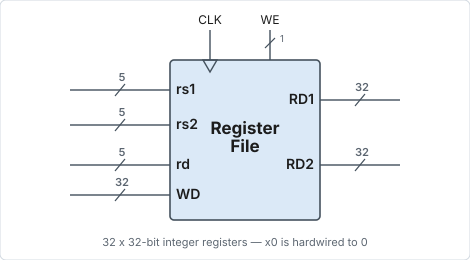

# Registers

## The register file

- There are **32 integer registers** (`x0`–`x31`).
    - Unlike ARM, which has 16 registers.
- This means that each register needs a **5-bit identifier**.
    - This is 4-bit for ARM.

<figure markdown="1">
{ width="470" }
<figcaption>The register file: three 5-bit address ports, one 32-bit write port, two 32-bit read ports.</figcaption>
</figure>

- There are also 32 floating-point extension registers if supporting floating
  point; as well as control and status registers (most not accessible in user
  mode).

## Calling convention (ABI)

The description below is the typical use (part of the calling convention / ABI)
for each register.

| Register  | ABI Name  | Description           | Saver  |
| --------- | --------- | --------------------- | ------ |
| `x0`      | `zero`    | Zero constant         | —      |
| `x1`      | `ra`      | Return address        | Caller |
| `x2`      | `sp`      | Stack pointer         | Callee |
| `x3`      | `gp`      | Global pointer        | —      |
| `x4`      | `tp`      | Thread pointer        | —      |
| `x5`–`x7`   | `t0`–`t2`   | Temporaries           | Caller |
| `x8`      | `s0` / `fp` | Saved / frame pointer | Callee |
| `x9`      | `s1`      | Saved register        | Callee |
| `x10`–`x11` | `a0`–`a1`   | Fn args/return values | Caller |
| `x12`–`x17` | `a2`–`a7`   | Fn args               | Caller |
| `x18`–`x27` | `s2`–`s11`  | Saved registers       | Callee |
| `x28`–`x31` | `t3`–`t6`   | Temporaries           | Caller |

## `x0` and the PC

- Register `x0` is **hardwired to 0**. Writes to `x0` are ignored.
    - Allows for easy comparison with 0.
    - The equivalent of MOV is implemented using
      addition with `x0`, etc.
- **PC is not a register** readable/writable explicitly by any instruction, i.e.
  it is not a visible register.
    - Unlike ARM, where PC can be specified as an operand (`R15`).
- Reading from PC can be done indirectly through `auipc`, `jal`, and branch
  instructions, which use PC itself as an operand.
    - And **not** PC+8 like in ARMv3 or PC+4 like in ARMv7M / Thumb2.
- Writing PC is done only by branch/jump instructions.

## Register reads and writes

!!! warning "One write port, two read ports"

    These two constraints shape a surprising amount of the rest of the ISA.

- **No instruction updates more than one visible register**, and the register
  updated is explicitly specified in the `rd` field.
    - This is unlike ARM, where some instructions such as
      BL update a visible register (`R14`/`LR`)
      *implicitly*, i.e. without 14 explicitly specified in the instruction.
    - This ensures that the register file needs only **one write port**.
    - This has some implications such as not having pre/post-indexed addressing,
      multiply/division not giving 64-bit results, etc. (discussed later).
- **No instruction reads more than two registers.** The register file needs only
  **2 read ports**.
    - This implies that instructions such as MLA
      (multiply and accumulate) are not possible.

## Flag registers

- There is **no flag register(s)** — flags are generated and used in the same
  instruction and not memorized for future use.[^slt]
- It was designed this way to minimize interaction between instructions.
- Only branch instructions are conditional, based on the result of a comparison
  done by the instruction itself — CMP +
  BEQ of ARM is replaced by `beq`.
- This also means the branch target computation cannot be done in the ALU, as
  the ALU does the comparison.

[^slt]: If the result of a comparison is needed for future use other than
    branching, an instruction such as `slt` is used. It writes the result to a
    general-purpose register rather than to a dedicated flag register/flip-flop.
