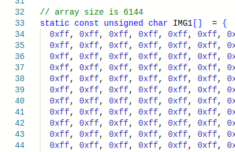

# Advanced Peripherals

## UART

### UART Details

In the following lines, 'read's and 'write's are from the perspective of the RISC-V processor (assembly language program), and act as 'console in' and 'console out' respectively.

* Read from the UART_RX only if the LSBit of UART_RX_VALID is set. Similarly, write to the UART_TX only if the LSBit UART_TX_READY is set (not very important if the processor runs on a slow clock).
* Successive writes to the UART (`sw` / `STR` followed by `sw` / `STR`, i.e., consecutive `sw`s / `STR`s in your assembly language program) are not supported. Similarly, successive reads (consecutive `lw`s / `LDR`s) are not supported.
* Allow sufficient time for the program to read a character before sending the next character from RealTerm. Any character received while one character is waiting to be read would be ignored. This shouldn't be a problem if your processor runs at high speed (CLK\_DIV\_BITS is low).

* A 32-bit number can be sent as hexadecimal in ASCII format (8 characters), which will require some processing in your program before it can be used as a 32-bit operand (note : '0' is 0x30 and 'A' is 0x41 in ASCII). It is a good idea to echo characters so that you can check whether UART has received it correctly. Also, note that backspace doesn't work to 'delete' the sent characters unless you implement such a functionality explicitly in your assembly language program.

* If you use a console, some parts of your program could be repetitive, best implemented using a subroutine. A subroutine is normally implemented using a `BL`/`jal` instruction which we have not implemented. A workaround can be seen in the HelloWorld program for Lab 2.

* In the simulation with UART, setting radix to ASCII could help.
* Read the instructions in Wrapper.v/vhd before using it.

### Realterm - Terminal for UART

[Realterm](https://canvas.nus.edu.sg/courses/62251/files/folder/Lab%20Resources?preview=4733363) is an amazing serial monitor program, which could be very useful. You can use this for sending and receiving data through the UART console. Teraterm (used in EE2028) is fine too, just that RealTerm is TeraTerm on steriods. RealTerm needs [.NET framework](https://canvas.nus.edu.sg/courses/62251/files/folder/Lab%20Resources?preview=4733365) to be installed.

Note : The baud rate used depends on the baud rate set in TOP.vhd. In the template provided, it is 115200.

**Figure 1(a) and 1(b)** : Screenshot illustrating RealTerm settings.

RealTerm allows you to send and display data that is not necessarily ASCII. Sending and receiving raw bytes can be very very useful. In fact, it is THE most effective way to get data in/out of the system.  

(to do: Provide a screenshot here illustrating sending bytes, and perhaps even an example assembly language program).

## OLED

OLED uses PMOD **B**.

The OLED controller has a built-in buffer, which means that your program does not have to keep feeding pixels continuously. Only changes need to be written.  

Caution: Do not leave OLED on for too long unnecessarily, especially with the same frame. It can cause burn-in.  

OLED_CTRL register functionality is described below.  

OLED_CTRL[3:0] : Change that triggers write. We can vary one of them (e.g., column) while keeping the other two the same. This can be efficient in applications like  [vector](https://en.m.wikipedia.org/wiki/Vector_graphics) graphics, where replicating a pixel along a row or column is common. In the example program where a line with a specified colour is drawn, we vary only x (columns).

* 0x0: vary_pixel_data_mode
* 0x1: vary_COL_mode (x)
* 0x2: vary_ROW_mode (y)

OLED_CTRL[7:4] : Colour format.

* 0x0: 8-bit colour mode: 1 byte per pixel, memory efficient especially if loading bitmapped images. Format: 3R-3G-2B.
* 0x1: 16-bit colour mode: Highest colour depth supported by the OLED in a compact representation. It is the OLED native input format: 5R-6G-5B.  
* 0x2: 24-bit colour mode: Similar to standard displays, but some LSBs are not used. Easier to visualise in simulation as each colour is a 2-hex digits. Wrapper output format: 5R-3(0)-6G-2(0)-5B-3(0).  

### Loading Images

The easiest way to load a [raster](https://en.wikipedia.org/wiki/Raster_graphics) image is to hard-code the array in C or assembly. This can be done easily using an online tool such as https://notisrac.github.io/FileToCArray/.  
 
It is also possible to receive the image at runtime via UART or initialise it in your HDL via a .mem file. However, these will limit your ability to simulate in RARS.

Before you think of loading a raster image - Make sure your data memory is big enough to hold the image. Adjust the depth/size in both HDL and C!
A not-too-complex vector image may not need a memory size increase or memory configuration change.

For a full-resolution raster image (96x64), the data memory size needed will exceed the 0x2000 size provided by the 'compact, text at 0' configuration You will have to use the RARS default configuration in this case.  

A full-resolution image with even 8-bit colour mode requires 6144 bytes, which means a DMEM_DEPTH_BITS of at least 13! The C code DMEM_SIZE should be 2^DMEM_DEPTH_BITS which is 0x2000 for DMEM_DEPTH_BITS of 13 in Wrapper.v

When you export byte arrays in the data segment from Godbolt to RARS, there could be an issue - RARS doesn't recognize the octal escape sequence emitted by compilers. A workaround is to copy-paste the actual C array into the data segment of RARS with a .byte declaration, instead of using the .ascii array emitted by the compiler. The rest of the generated assembly is fine. This is illustrated in the figures below.  

  
C Code  

  
Octal array emitted by the compiler  

  
Copy-pasted array fix in RARS with .byte declaration

### Food for thought

* It may be better to use synchronous read and use block RAMs if you have many images. Else, you will quickly run out of LUTs.
* Image pixels being sent column-wise is advantageous if the conversion tool can give a column-major format for the array. This is because multiplication by 64 is easier than by 96.
  * Clang emits `mul` instructions when you multiply by 96, GCC does y\*64+y\*32 instead in some optimization modes.
  * It is not uncommon to allocate memory that is larger than the required size to make the buffer dimensions powers of two - trading off memory for performance!
  * Possible enhancement: Implementing a mode where the row/column indices autoincrement in a row-major/column-major manner can accelerate the loading of raster images. Only one write per pixel will suffice, with the ability to feed data from a C array without maintaining separate row/column indices. You will need to implement some control bits in the control register to enable this (and an additional bit if you wish to allow the user to choose between row-major / column-major formats), along with other changes in the Wrapper. 
* It is not possible to read back what you wrote to the OLED. Something = *OLED_DATA_ADDR does not work. These are memory-mapped peripherals; do not treat like memory. However, it is possible to modify the Wrapper and TOP to accomplish this, but has some issues such as needing 2 clock cycles for a read.

## Accelerometer

The accelerometer gives the temperature and X, Y, Z accelerations.  
ACCEL_DATA is a 32-bit value packing 4 independent 8-bit values <temperature, X, Y, Z> MSB downto LSB.  
Each value is in 8-bit signed format with a range of +/- 2g. So a reading of 1g is 0x40 and -1g is 0xC0.  
The sensor in fact gives a 12-bit reading, but uses only 8 bits for simplicity.  
The calibration is not perfect on all boards, so do not be surprised if there is a fixed offset to all your readings.  

If you want only a specific axis or temperature, use a combination of logical operators and shift e.g., extract Y using (*ACC_DATA_ADDR & 0x0000FF00) >> 8. If your processor can do `lbu`, the required byte can be read directly.  

ACCEL_DREADY indicates data readiness, which is useful only when attempting to read at a high rate.

## Cycle Counter

Cycle counter gives the number of processor cycles that have elapsed since the last reset.  
Cycle counter rolls over at 42 seconds at 100 MHz (CLK_DIV_BITS = 0), but is much longer at lower frequencies.  
Change counter width and bits used in Wrapper for a longer duration, but lower cycles precision.  
