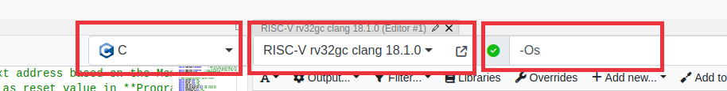

# Using Compiled Code

You can use the .C file in the [Assignment 2 Optional Stuff](https://github.com/NUS-CG3207/labs/tree/main/docs/code_templates/Asst_02/Optional_Stuff) folder as a sample. The corresponding .asm is also provided for reference. Please make sure you read the comments in the .C and .asm files.

Please note some other points below.

* To the extent possible, it is a good idea to test your algorithms (e.g., masking and shifts to deal with bytes within a word.) in a standard C compiler, making appropriate changes (e.g., `printf()` and `scanf()`/hardcoding to simulate actual system input and output) to run in a desktop environment.
* Follow the Godbolt settings as shown. Ok to use a different/newer non-trunk version.
  * The default Godbolt language maybe C++, change it to C. C++ compiler does stuff like name mangling which we can do without.
  * Clang produces more comprehensible code than GCC, though sometimes at the expense of increased code size.
  * In fact, GCC with `-Os -fwhole-program` can produce very optimised code with a flattened hierarchy (function calls removed), but can be pretty hard to make sense of. This can be useful if your processor does not support `jal` fully and `jalr` yet. In any case, do not use the trunk version of GCC.
* Do not use library functions such as `printf()`. If need be, implement your own, simple versions of these functions.
* Make sure that only those instructions supported by your processor are generated. Check in the RARS execute window for actual instructions.
* Typically, the only essential change needed for the assembly code generated by Godbolt/Clang is to have a .data inserted just before the data declarations.
* Check the actual number of instructions (not lines of code as some instructions are pseudoinstructions). Make sure the size is set in Wrapper `IROM_DEPTH_BITS` as appropriate. e.g., should be 10 if the number of instructions is >128 and <=255.
* `DMEM_DEPTH_BITS` should also be changed as appropriate, if you need more memory such as what you will need when you load images. `STACK_INIT` in your C source code should also be modified to correspond to this.
  * Stack pointer is set to point to the top of DMEM initially (`STACK_INIT`). The stack is full-descending, so the first value is pushed to `STACK_INIT-4`.
  * In the example C code (in the repo above), this is done via inline assembly. Alternatives are
    * Insert an assembly statement `la sp, STACK_INIT` as the first line in your assembly code `.text` section.
    * Hard-code `RegBank[5'b00010]` initialization value to `STACK_INIT` via an `initial` block in `RegFile.v`. Of course, `STACK_INIT` should have a proper value via a `.equ` or be passed as a parameter to the `RegFile` module.
* Make sure the correct memory config is selected in RARS.
* Pitfall of using larger instruction and/or data memory : your maximum clock frequency usually suffers. Bigger = slower is a fundamental law of nature that is not easy to work around.
* The first few instructions that save Callee saved registers to the stack can be deleted safely - do a sanity check to see if this is really the case nevertheless. There is no caller for `main()`.
* Make sure the main function code is at the beginning. Some compilers such as GCC may put this in the end, in which case you need to rearrange the functions in assembly. Our absolute bare-metal system does not have a linker/loader/startup code to start at the main if it is not in the beginning.
* Simulate the code in RARS.
  * When using memory-mapped input peripherals, the corresponding address location should be modified just before the corresponding `lw` is executed to simulate the data coming in from peripherals.
  * If you are using the counter peripheral for delay, you might want to use a smaller delay for simulation and change the code to a bigger value later. This can be changed in C code or directly in assembly (likely `lui`).
  * Though you can't see OLED output, it is fairly easy to check the row, column, pixel colour, and pixel write signals and get a sense.
* Export the instruction and data memory as hexadecimal text, overwriting the `AA_IROM.mem` and `AA_DMEM.mem` that are added to the Vivado project.
* Simulate in HDL behavioral sim, after changing the `test_Wrapper` to give stimuli according to the inputs expected by your C/assembly program. Synthesize and do a post-synthesis simulation as well.
* Finally, run immplementation and generate bitstream. Fingers crossed :)
